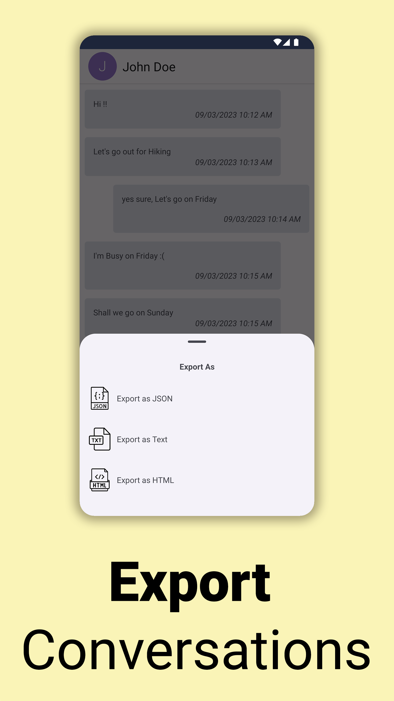

## Backup & Restore Device Messages, Export SMS to Text File, Sync across Devices.

SMS Drive is a simple and easy backup solution to sync your SMS messages across devices. You don't need to uninstall your favorite default SMS App, SMS Drive is made to work along with default SMS App as an Companion for backup drive.

### Features:
- Sync Messages Across Multiple Devices.
- Backup & Restore Messages
- Unlimited Cloud Storage.
- Auto-Backup Messages
- Export SMS to Text, HTML, JSON File
- Low Data Bandwidth consumption thanks to our strong data compression for upload/download

## Straight out of the box, SMS Drive is super easy to use.

It's not just your SMS Backup, but also Sync across multiple Devices.There is a good chance you’ve got an SMS message or two on your Android device, and there is a good chance you’d rather not lose them if you happen to misplace your phone. Perhaps you should look at backing up your SMS messages on a regular basis, that's when SMS Drive helps you to keep your messages Safe & Secure Backup. 

## Unlimited Storage

We Provide Unlimited Cloud Storage for so that you will not have to worry about device storage space. Unlimited plans have no restrictions on how much you can store messages on your cloud server and give you all the space you need. Our Powerful Storage can adapt to the needs of growing data and will always have room for more messages to backup. 

## Sync Across Multiple Devices

Sync SMS across multiple Devices and access them anytime, anywhere. SMS Drive sync is, perhaps, one of the simplest ways to sync & access your messages on multiple devices. SMS Drive will start syncing the Messages any time a change is detected or in Custom Sync Interval set by user. 

## Export to File

You can export sms to various file formats such as Text, HTML, JSON.

## Your SMS App Companion

You don't need to uninstall your favorite default SMS App, SMS Drive is made to work along with default SMS App as a Companion for backup drive. SMS Drive can also become your default SMS App for receiving messages.

#### Official Website:

https://deveshrx.com/apps/sms-drive

## Screenshots

